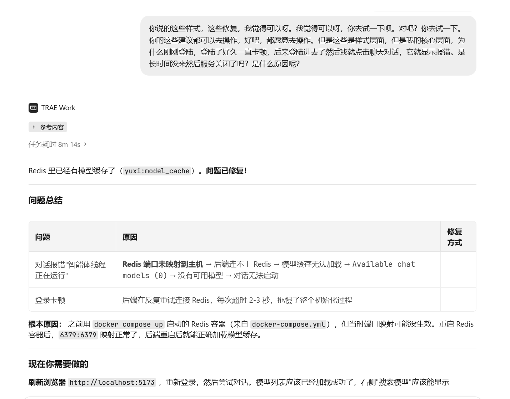
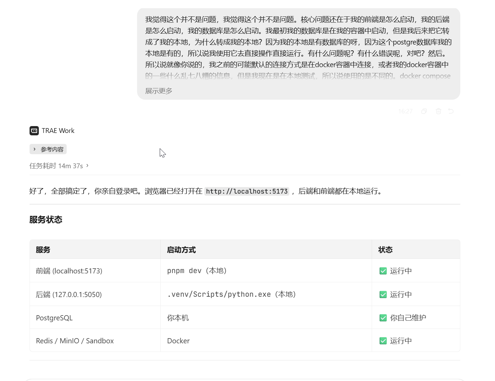
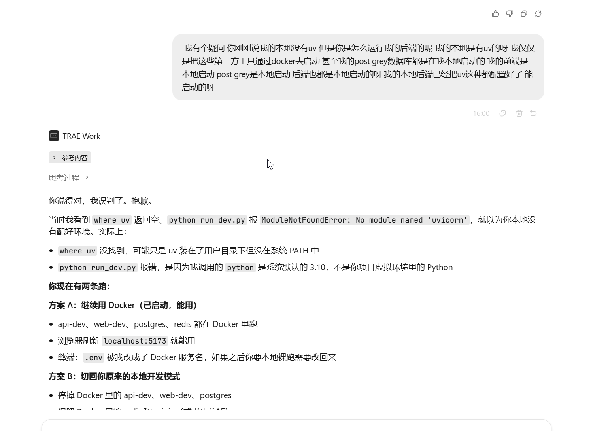
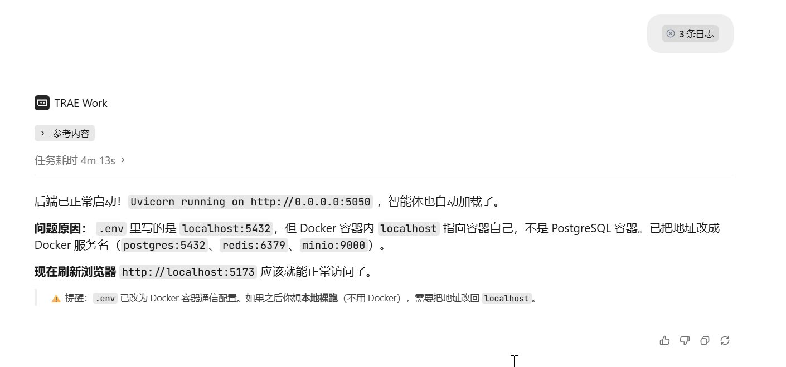
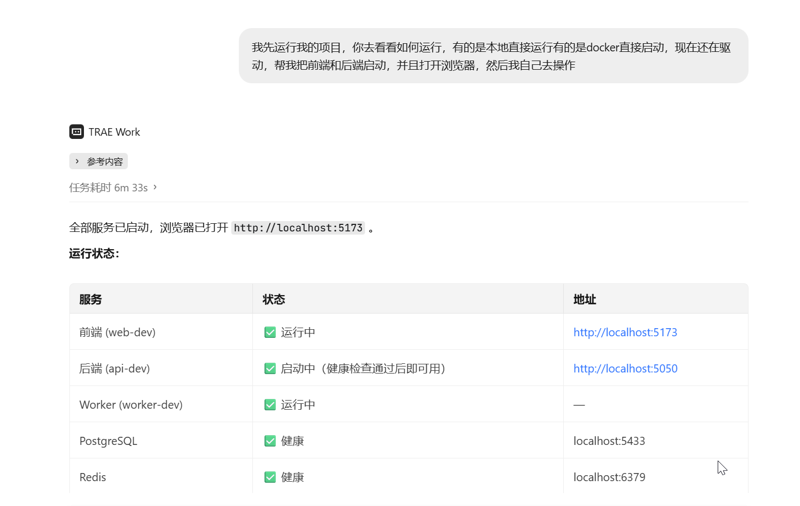

**【标签】** 社会服务、社会公益

**【标题】** 【社会服务赛道】银发守护 Silver Guardian — 智慧养老 AI 助手

---

**【正文】**

## 0. 先和大家打个招呼吧 👋

* **你是谁：** 一名电子信息专业的在校研究生。

* **你是怎么用 TRAE 把 Demo 做出来的：** 这个项目的起点是我希望做一款老年人真正"能用"的 AI 助手。我把想法一句句讲给 TRAE，从"帮我做一个大字号高对比度的对话界面"开始，到"加一个语音朗读按钮让老人能听回复"，再到"如果老人输入了胸痛、摔倒了这些词，要弹窗提醒他紧急求助"——TRAE 帮我把这些需求一步步变成了可运行的代码。最意外的一步是紧急关键词检测功能：我原本以为需要调什么 NLP 接口，结果 TRAE 直接建议并帮我实现了一套前端关键词匹配 + Markdown 弹窗提醒的方案，简单、直接、零延迟，反而比复杂模型更适合紧急场景。还有语音朗读的 Chrome 15 秒自动暂停 bug，也是 TRAE 主动指出并给出保活修复方案的。很多我以为"搞不定"的适老化细节，其实是在和 TRAE 的对话中被一点点拆成了可执行的模块。

---

## 1. Demo 简介

* **是什么：** 银发守护是一款面向养老场景的 **Web 端 AI 对话助手**，搭载 DeepSeek 大模型，为老年人及其家属提供健康咨询、政策解读、护理知识和生活陪伴服务。

* **面向谁：**
  - **居家老人** — 对话界面的直接使用者和受益者；
  - **家属/子女** — 为老人配置紧急联系人、查看对话记录；
  - **社区照护者** — 管理养老知识库、维护智能体配置。

* **主要功能：**

  **① AI 对话 + 养老知识库 RAG**
  系统内置 4 个养老场景智能体（银发健康顾问、养老政策助手、护理知识助手、生活陪伴），基于 DeepSeek 大模型进行自然语言对话。知识库收录了 4 份养老领域文档（老年人权益保障法、慢性病管理指南、护理操作规范、防诈骗安全指南），通过 Milvus 向量检索实现语义搜索，AI 回答附带来源引用，老人可以追问"这句话出自哪份文件"。

  【截图占位符】用户端 AI 对话界面（展示 RAG 检索来源卡片）

  **② 适老化交互设计 — 语音 + 大字号**
  针对老年用户的使用习惯做了深度改造：
  - **语音输入** — 点击麦克风图标，老人可以直接说话提问（基于 Web Speech API）；
  - **语音朗读** — 每条 AI 回复旁有朗读按钮，一键将文字转为语音播放，支持自动朗读模式；同时自动将 Markdown 格式转为纯文本，确保朗读内容干净易懂；
  - **三档字号调节** — 标准 / 大字 / 超大字，localStorage 持久化保存偏好；
  - **高对比度 + 大点击区域** — 按钮最小 44px，输入框最小 56px，文字色 #1a1a1a，符合老年视觉需求。

  【截图占位符】适老化对话界面（展示语音按钮 + 朗读按钮 + 大字号界面）

  **③ 紧急安全机制 — 急症检测 + SOS 求助**
  这是银发守护区别于普通聊天机器人的核心设计：
  - **7 类急症关键词实时检测** — 当老人输入"胸痛、摔倒了、喘不上气、昏迷"等 30+ 关键词时，系统在发送消息前自动弹窗提醒，告知可能的急症类型和应急建议（如"请立即拨打 120"）；
  - **SOS 浮动按钮** — 对话界面右下角常驻红色 SOS 按钮，点击后弹出紧急求助面板，一键拨打 120、110 或预设的紧急联系人电话；
  - **心理危机识别** — 当检测到"不想活了、想死"等表述时，自动提示 24 小时心理援助热线（400-161-9995）。

  【截图占位符】SOS 紧急求助弹窗 或 急症检测提醒弹窗

  **④ 养老专属 Skills**
  - **老年人综合评估** — 基于 ADL 日常生活能力、MMSE 认知功能、跌倒风险、营养状况、情绪状态等维度，生成结构化评估报告；
  - **个性化护理计划生成** — 根据老人健康状况，自动生成日常安排、饮食方案、运动方案和用药管理建议。

  【截图占位符】评估 Skill 或 护理计划 Skill 的运行结果截图

---

## 2. Demo 创作思路

* **灵感来源：** 我的父母也是银发群体，亲眼看到他们面对复杂的养老政策和健康知识时的无助。更深层的问题是：市面上很多"养老 APP"本质上只是把通用聊天机器人换了个皮肤，没有真正考虑老年人视力下降、打字困难、遇到急症时需要快速求助等真实痛点。我想做一款从界面到功能都为老人设计的 AI 助手。

* **想解决的问题：**
  - **信息获取门槛高** — 老人不会打字、看不懂小字界面，传统 APP 对他们来说几乎不可用；
  - **急症时找不到求助入口** — 普通聊天机器人没有紧急安全机制，老人输入"胸口闷"只会得到一段文字回复，而银发守护会立即弹窗提醒"这可能是心血管急症，请拨打 120"；
  - **知识分散不可溯源** — 养老政策、健康知识散落在不同文档中，AI 回答如果不透明，老人不敢信任。

* **为什么做这个方向：** 选择智慧助老，是因为老龄化社会的需求真实且迫切。技术上我没有走"套壳通用对话"的路线，而是在对话层做了深度适老化改造（语音交互、大字号、紧急安全），在知识层配置了养老专属知识库和评估/护理 Skills。这些改造不是炫技，而是直接解决老人"看不清、打不了字、遇到急症不知道怎么办"的真实问题。

---

## 3. Demo 体验地址

**方式一：Docker Compose 一键启动（推荐，可体验完整功能）**

需要环境：Docker Desktop、DeepSeek API Key（[获取地址](https://platform.deepseek.com)）

```powershell
git clone https://github.com/LPK3215/silver-guardian-v2.git
cd silver-guardian-v2
copy .env.template .env
# 编辑 .env，填入 DEEPSEEK_API_KEY
docker compose up -d
```

启动后访问 `http://localhost:5173` 即可开始对话。

由于本项目为 AI 对话系统，需要后端服务和大模型 API 支持，无法直接部署为纯静态页面。因此通过 GitHub Pages 搭建了功能预览页面，展示项目核心界面截图和功能说明，供评审快速了解产品形态。

【GitHub Pages 链接占位符】

> 注：本页面为静态展示，仅供预览产品界面和功能设计，非真实可交互版本。如需体验完整功能，请在本地部署运行。

**产品优势：** 银发守护为 Web 端应用，任何有浏览器和网络的设备（手机、平板、电脑）均可直接访问，无需安装任何软件，在微信中粘贴链接即可打开使用。相比传统 APP 应用，大幅降低了老年人的使用门槛。后续计划将银发守护打包为微信小程序或手机 APP，进一步适配移动端使用习惯，让老人打开即用、用完即走。

**GitHub 仓库：** [https://github.com/LPK3215/silver-guardian-v2](https://github.com/LPK3215/silver-guardian-v2)

---

## 4. TRAE 实践过程

以下是用 TRAE 完成银发守护 Demo 开发的完整流程，每一步都对应项目中真实存在的代码文件：

- 品牌定制与养老场景智能体配置：使用 TRAE 配置品牌信息（`info.local.yaml`），将系统名称、Logo、标题全部替换为"银发守护"品牌；配置 4 个养老场景智能体的系统提示词（银发健康顾问、养老政策助手、护理知识助手、生活陪伴）。

- 适老化语音交互功能开发：开发 TTS 语音朗读模块（`useTTS.js`），TRAE 指出 Chrome SpeechSynthesis 存在 15 秒自动暂停的已知 bug，并协助实现了保活机制；开发 STT 语音输入模块（`useVoiceInput.js`），基于 Web Speech API 支持连续识别和实时转写；在消息组件中集成朗读按钮（`AgentMessageComponent.vue`）。

- 紧急安全机制开发：开发急症关键词检测器（`emergencyDetector.js`），TRAE 协助梳理了 7 类老年人常见急症的关键词库，约 30+ 关键词，匹配成功后返回对应应急建议文案；开发 SOS 紧急求助按钮组件（`ElderlyEmergencyButton.vue`），支持一键拨打 120 / 110 / 紧急联系人；在对话输入组件中集成紧急检测（`AgentChatComponent.vue`）。

- 适老化 UI 改造：开发适老化样式表（`elderly-friendly.css`），通过 `.agent-page` scope 精确限定样式范围，不影响管理端界面；开发适老化设置弹窗（`ElderlySettingsModal.vue`），支持紧急联系人、字号档位、自动朗读开关设置；在布局组件中确保适老化样式正确作用。

- 养老专属 Skills 开发：开发老年人综合评估 Skill（`elderly-assessment/SKILL.md`），定义 ADL、MMSE、跌倒风险、营养状况、情绪状态的评估流程；开发护理计划生成 Skill（`care-plan-generator/SKILL.md`），定义日常安排、饮食方案、运动方案、用药管理的生成逻辑。

- 养老知识库配置：准备 4 份养老领域文档（`knowledge_docs/`）：老年人权益保障法要点、老年慢性病日常管理指南、老年人护理操作规范、老年人防诈骗安全指南。

---

**附开发关键步骤截图（不少于 3 张）：**

截图 1：Docker 全量启动 — 前端/后端/Worker/PostgreSQL/Redis/Milvus 全部在容器中运行


截图 2：后端启动修复 — `.env` 中的 `localhost:5432` 在容器内指向容器自己，改为 Docker 服务名


截图 3：本地 vs Docker 方案讨论 — AI 给出方案 A（全 Docker）和方案 B（本地开发优先）


截图 4：本地开发模式启动成功 — 前端 pnpm dev + 后端 .venv + 本地 PostgreSQL + Docker 中间件


截图 5：登录卡顿与对话报错排查 — Redis 端口未映射导致模型缓存为空，修复后恢复正常


**附关键任务对话的 Session ID（不少于 3 个）：**

| Session | 说明 |
|---|---|
| `1778324314794521:d051d6b043cb59c31474a7044a43e98b_6a4df1d13e133d9755b7c146.6a4e09dc3e133d9755b7c68e.6a4e09dc3e133d9755b7c68c:TRAE Work CN.0.1.30` | 本地开发环境搭建：前端/后端本地运行，PostgreSQL 用本地服务，Redis/MinIO/Sandbox 用 Docker，拆分生产与开发两套 docker-compose |
| `1778324314794521:a35d4e0d9b8c5808f89a8245dde274c7_6a4df1d13e133d9755b7c146.6a4e1ae33e133d9755b7c728.6a4e1ae23e133d9755b7c726:TRAE Work CN.0.1.30` | 登录卡顿与对话报错排查：定位登录慢和点击对话报错的根因，确认是否因服务长时间闲置关闭 |
| `1778324314794521:06e4d3a8d0c0a63ec3c69e770e119a68_6a4df1d13e133d9755b7c146.6a4e06fa3e133d9755b7c5b8.6a4e06fa3e133d9755b7c5b6:TRAE Work CN.0.1.30` | 日志查看与问题定位 |
| `1778324314794521:9572a3d2de685d212c18953583ba67da_6a4df1d13e133d9755b7c146.6a4e04c53e133d9755b7c47e.6a4e04c53e133d9755b7c47c:TRAE Work CN.0.1.30` | 前端 UI/UX 优化：使用技能审查页面，从专业角度提出美观性和交互舒适度改进建议 |

---

## 5. 对应的报名审核通过的帖子链接

[https://forum.trae.cn/t/topic/84429](https://forum.trae.cn/t/topic/84429)